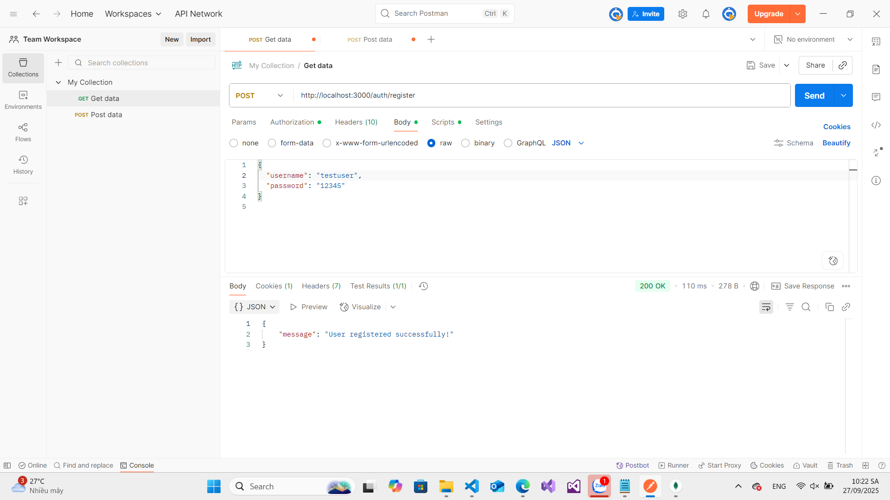
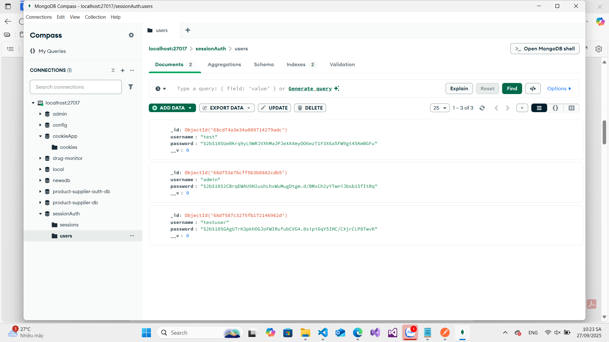
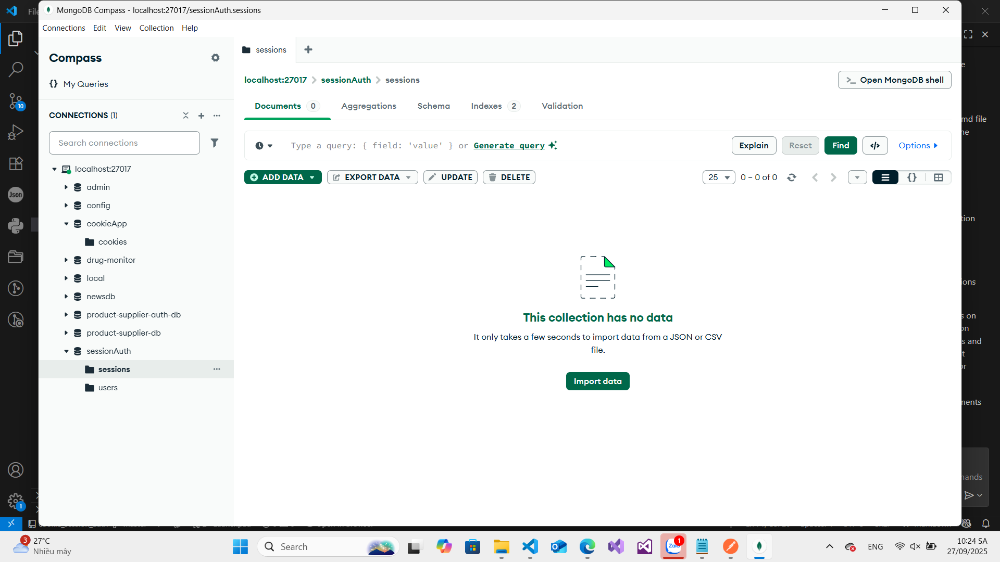
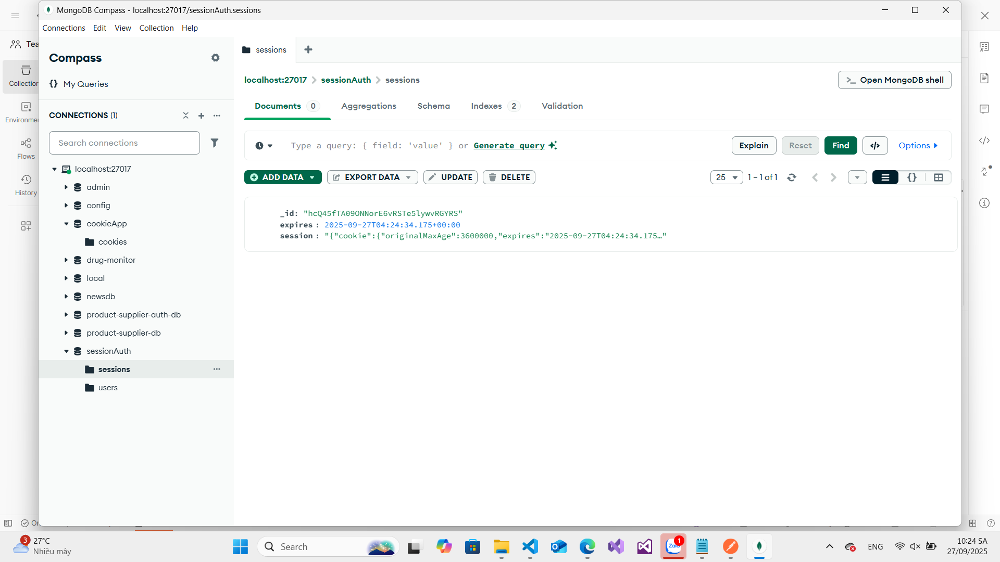
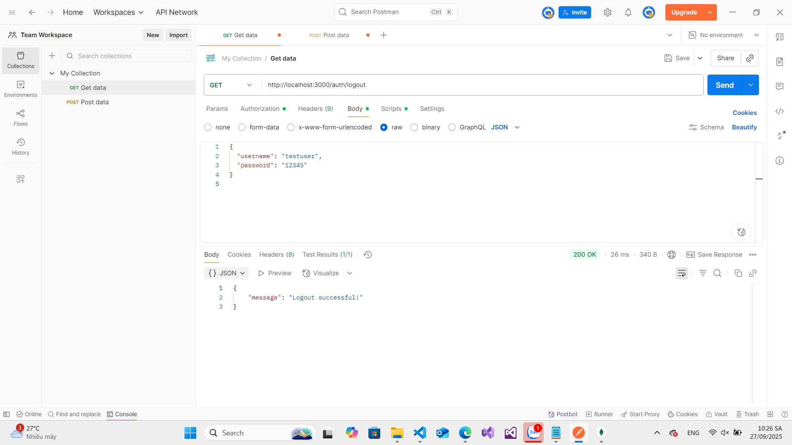
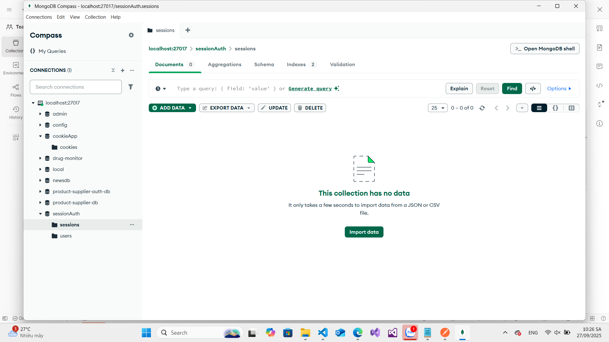
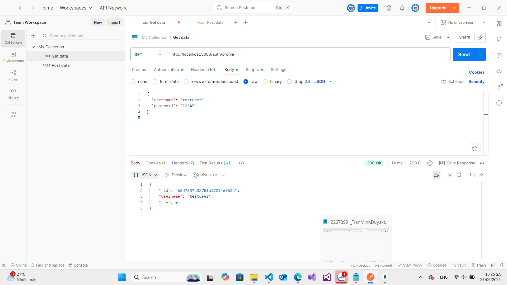

# Cookie Session Authentication

A secure Node.js authentication system using Express sessions with MongoDB storage and cookie-based authentication.

## Features

- User registration and login system
- Secure password hashing with bcrypt
- Session-based authentication using cookies
- MongoDB session storage
- Protected routes
- Automatic session expiration
- Secure cookie configuration
- User profile access

## Project Structure

```
cookie_session_auth/
├── app.js              # Main application file
├── package.json        # Project dependencies
├── models/
│   └── User.js        # User model with password hashing
└── routes/
    └── auth.js        # Authentication routes
```

## Dependencies

- Express.js (^5.1.0) - Web framework
- Express-session (^1.18.2) - Session middleware
- Connect-mongo (^5.1.0) - MongoDB session store
- Cookie-parser (^1.4.7) - Cookie handling
- Mongoose (^8.18.1) - MongoDB ODM
- Bcryptjs (^3.0.2) - Password hashing

## Setup

1. Install dependencies:
```bash
npm install
```

2. Make sure MongoDB is running:
```bash
mongod
```

3. Start the server:
```bash
node app.js
```

The server will start on http://localhost:3000

## API Endpoints

### Authentication Routes

#### Register a new user
```
POST /auth/register
Content-Type: application/json

{
  "username": "yourusername",
  "password": "yourpassword"
}
```

- Check in database


#### Login
```
POST /auth/login
Content-Type: application/json

{
  "username": "yourusername",
  "password": "yourpassword"
}
```

- Check in database

#### Logout
```
GET /auth/logout
```

- Check in database

#### Get User Profile (Protected Route)
```
GET /auth/profile
```
Requires an active session (must be logged in)


## Session Configuration

- Session Duration: 1 hour
- Cookie Security:
  - HttpOnly: Enabled (prevents client-side access)
  - Secure: Disabled (enable for HTTPS)
  - Session store: MongoDB

## Security Features

1. Password Hashing
   - Uses bcrypt with salt rounds of 10
   - Automatically hashes passwords on user creation/update

2. Session Security
   - Secure session storage in MongoDB
   - Session middleware configuration
   - HTTP-only cookies
   - Session expiration handling

3. Protected Routes
   - Session validation middleware
   - Unauthorized access prevention

## Development Notes

- The application uses MongoDB as both a user database and session store
- Sessions are stored in the 'sessionAuth' database
- Password comparison is done securely using bcrypt
- Sessions automatically expire after 1 hour of inactivity

## Environment Setup

Make sure you have:
- Node.js installed
- MongoDB installed and running
- MongoDB running on default port (27017)

## Security Recommendations for Production

1. Use environment variables for sensitive data
2. Enable secure cookies when using HTTPS
3. Implement rate limiting
4. Add CSRF protection
5. Use a more complex session secret
6. Enable proper error logging
7. Implement input validation
8. Add password strength requirements

## License

ISC
